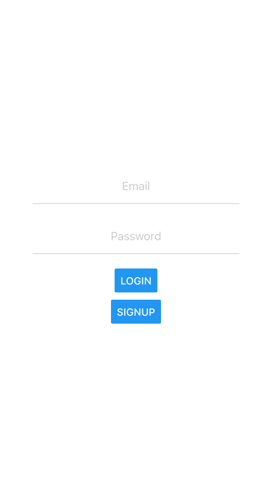
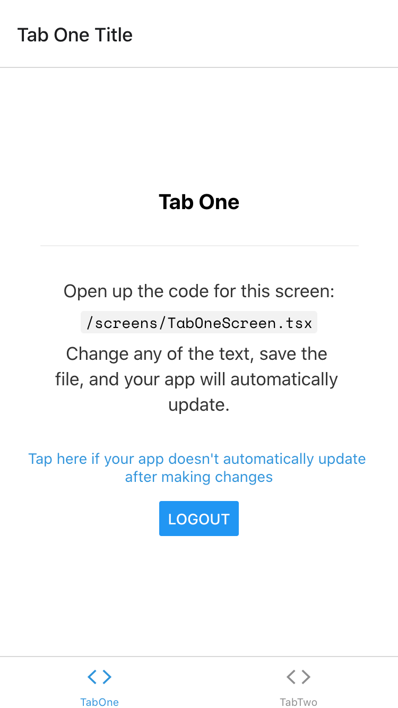

This repository is based on ExpoStarter's Tab(TypeScript) with Firebase Authentication login.

## Usage

```
$ yarn
```

Paste your FirebaseConfig into firebase/index.ts

```js
const firebaseConfig = {
  apiKey: '',
  authDomain: '',
  databaseURL: '',
  projectId: '',
  storageBucket: '',
  messagingSenderId: '',
  appId: '',
  measurementId: '',
};
```


```
$ yarn start
```


LoginScreen | AfterLoginScreen
 | 